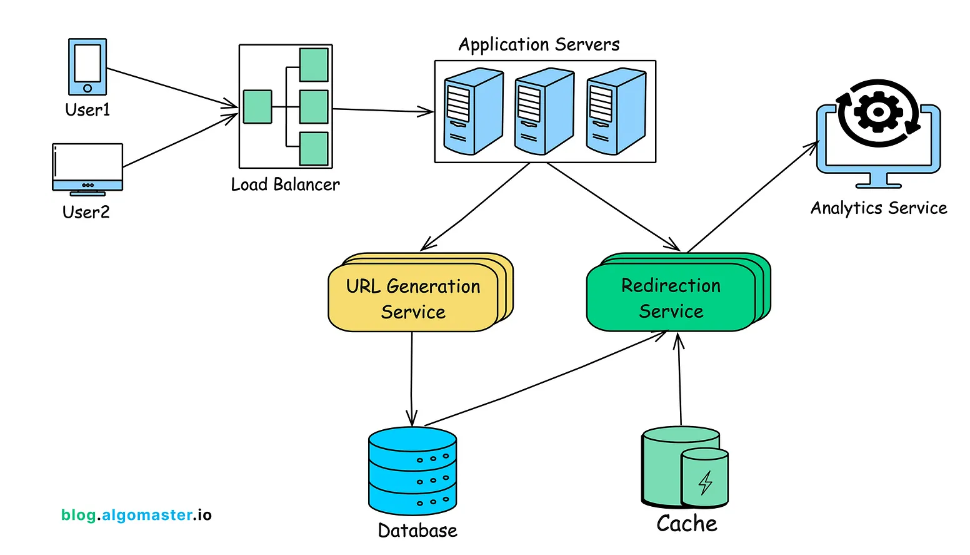

# Requirements Gathering
## Functional Requirements:
- Generate a unique short URL for a given long URL
- Redirect the user to the original URL when the short URL is accessed
- Allow users to customize their short URLs (optional)
- Support link expiration where URLs are no longer accessible after a certain period
- Provide analytics on link usage (optional)

## Non-Functional Requirements:
- High availability (the service should be up 99.9% of the time)
- Low latency (url shortening and redirects should happen in milliseconds)
- Scalability (the system should handle millions of requests per day)
- Durability (shortened URLs should work for years)
- Security to prevent malicious use, such as phishing.


# Capacity Estimation
- URL Lengths: Average original URL length of 100 characters
- Daily URL Shortening Requests: 1 million requests per day

# High Level Design 


# 5. System API Design
## 5.1 URL Shortening API

### Endpoint: POST /api/v1/shorten

- Sample Request:
```json
{"long_url":"",
"custom_alias":"",
"expiry_data":"",
"user_id":"user123"
}
```

- Sample Response:
```json
{"short_url":"",
"long_url":"",
"expiry_data":"",
"created_at":""
}
```

## 5.2 URL Shortening API
### Endpoint: GET /{short_url_key}


